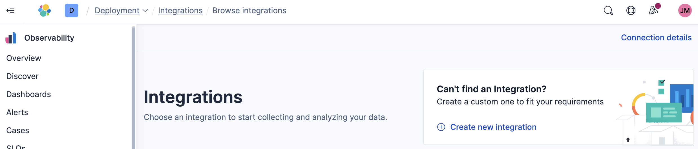
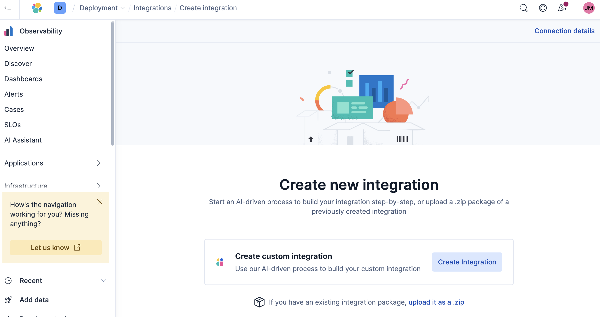

# Chargeback (ES|QL Version) Integration

This document outlines the steps to install the Chargeback integration, which makes use of the smart `ES|QL LOOKUP JOIN` feature (conditional joins) requiring Stack version 9.2.0+.

## Migrate from "module" to integration

If you have already installed the Chargeback "module" and want to rather use the integration, please follow the [Decommissioning](../module/Decommissioning.md) instructions of the module, and then return to these instructions.

## Setup Instructions

To install the Chargeback integration, please follow these steps:

### 1. Meet Prerequisites

See [Requirements](README.md#requirements) for details.

### 2. Create Lookup Indices and Data View: 
- Copy the Index creation commands (below) to Kibana Dev Tools.
- If required, modify the desired values for the `chargeback_conf_lookup` index. Note, these can be changed at a later stage.
    - Change the `conf_*_weight` values to set the blended weight calculations, or use defaults.
    - Change the `conf_ecu_rate` value so that the dashboard is in the desired rate, and `conf_ecu_rate_unit` to the unit representing the rate. For example a rate of `17.6` and unit of `ZAR` will show the cost in South African Rand, wherease a rate of `1` and unit of `USD` will show the cost in United States Dollar.
- Create the required `mode: lookup` indices by executing all of the commands.
- Create the required Kibana data view which is used in the Dashboard control.

<details>

```
# Create the config lookup index for chargeback configuration.
# This index will store configuration settings. Multiple documents can be added for different time periods.

PUT chargeback_conf_lookup
{
  "settings": { 
    "index.mode": "lookup"
  },
  "mappings": {
    "_meta": {
      "managed": true,
      "package": { "name": "chargeback", "version": "0.2.9" }
    },
    "properties": {
      "config_join_key": { "type": "keyword" },
      "conf_ecu_rate": { "type": "float" },
      "conf_ecu_rate_unit": { "type": "keyword"},
      "conf_indexing_weight": { "type": "integer" },
      "conf_query_weight": { "type": "integer" },
      "conf_storage_weight": { "type": "integer" },
      "conf_start_date": {"type": "date"},
      "conf_end_date": {"type": "date"}
    }
  }
}

# Add the default configuration to the chargeback_conf_lookup index with ID "config".
# This creates a document that can be updated later using _update/config.
POST chargeback_conf_lookup/_doc/config
{
  "config_join_key": "chargeback_config",
  "conf_ecu_rate": 0.85,
  "conf_ecu_rate_unit": "EUR",
  "conf_indexing_weight": 20,
  "conf_query_weight": 20,
  "conf_storage_weight": 40,
  "conf_start_date": "2024-01-01T00:00:00.000Z",
  "conf_end_date": "2024-12-31T23:59:59.999Z"
}

# Add additional configuration for a different time period (optional).
# This creates a new document with an auto-generated ID for time-based rate changes.
POST chargeback_conf_lookup/_doc
{
  "config_join_key": "chargeback_config",
  "conf_ecu_rate": 0.95,
  "conf_ecu_rate_unit": "EUR",
  "conf_indexing_weight": 20,
  "conf_query_weight": 20,
  "conf_storage_weight": 40,
  "conf_start_date": "2025-01-01T00:00:00.000Z",
  "conf_end_date": "2025-12-31T23:59:59.999Z"
}
```

</details>

## Configuration

Configuration values are stored in the `chargeback_conf_lookup` index. The dashboard automatically applies the correct configuration based on the billing date falling within the `conf_start_date` and `conf_end_date` range.

### Update the default configuration:

Using `_update/config` updates the document with ID `config`:

```
POST chargeback_conf_lookup/_update/config
{
  "doc": {
    "conf_ecu_rate": 0.85,
    "conf_ecu_rate_unit": "EUR",
    "conf_indexing_weight": 20,
    "conf_query_weight": 20,
    "conf_storage_weight": 40,
    "conf_start_date": "2024-01-01T00:00:00.000Z",
    "conf_end_date": "2024-12-31T23:59:59.999Z"
  }
}
```

### Add a new configuration period (for time-based rate changes):

Using `_doc` creates a new document with an auto-generated ID:

```
POST chargeback_conf_lookup/_doc
{
  "config_join_key": "chargeback_config",
  "conf_ecu_rate": 0.95,
  "conf_ecu_rate_unit": "EUR",
  "conf_indexing_weight": 20,
  "conf_query_weight": 20,
  "conf_storage_weight": 40,
  "conf_start_date": "2025-01-01T00:00:00.000Z",
  "conf_end_date": "2025-12-31T23:59:59.999Z"
}
```


### 3. Upload ZIP File: 

- Asset: [`chargeback-0.2.9.zip`](assets/0.2.9/chargeback-0.2.9.zip)
- Browse to Integrations, and click on `+ Create new integration`



- Upload the provided ZIP file by clicking on `upload it as a .zip`



### 4. Transforms Auto-Start

Starting from version 0.2.8, all Chargeback transforms are configured to auto-start upon installation. You no longer need to manually start the transforms.

**Performance Note:** On clusters with months of historical monitoring data for multiple deployments, the initial transform execution may process a large volume of data. This can cause temporary performance impact during the first run. The transforms will then run incrementally on their configured schedules (15-60 minute intervals), processing only new data with minimal overhead.

### 5. Configure Alerting Rules (Optional)

Version 0.2.8 includes three pre-configured alerting rule templates:
- **Transform Health Monitoring** - Monitors transform health status
- **New Chargeback Group Detection** - Alerts on new chargeback group tags
- **Missing Usage Data** - Detects deployments with missing usage data

These rules can be configured in **Stack Management → Rules** after installation.

**Important:** For the New Chargeback Group Detection and Missing Usage Data alert rules, ensure that the Chargeback transforms are running before setting them up. These alerting rules query the lookup indices created by the transforms. If the transforms are not started, the alerts will not function correctly.

## Upgrade integration

To upgrade the integration, do the following:
- Depending on the change in version, you might need to delete the `*_lookup` indices, and create them again.
- Upload the new asset (ZIP) file to Kibana.
- For versions prior to 0.2.8, start the transforms manually. From 0.2.8 onwards, transforms auto-start.
