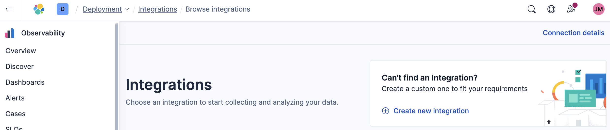
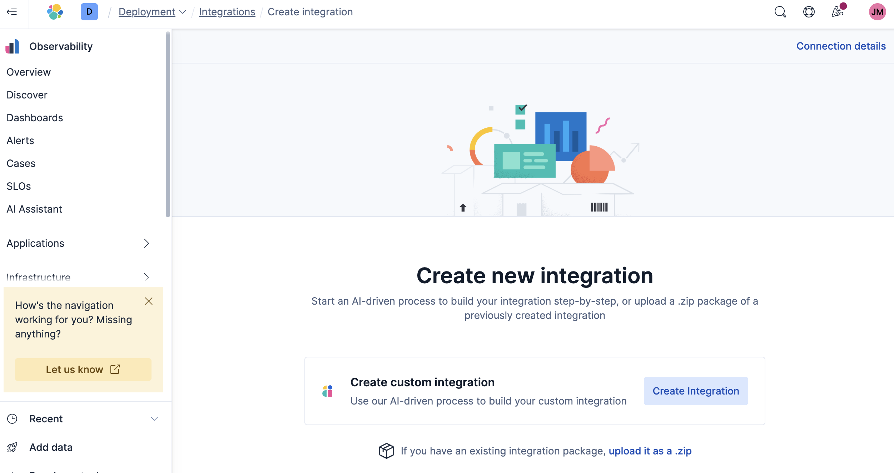

# Chargeback (ES|QL Version) Integration

This document outlines the steps to install the Chargeback integration, which makes use of the ES|QL LOOKUP JOIN feature introduced in 8.18.

## Instructions version 0.0.2

To install the Chargeback integration (version 0.0.2), please follow these steps:

1. Meet Prerequisites: 
- Monitoring cluster needs to be on 8.18.0+ to be able to use the ES|QL LOOKUP JOIN feature.
- The Monitoring cluster must be hosted on Elastic Cloud (ECH).
- Elasticsearch Service Billing integration (version 1.0.0+) must be installed on the Monitoring cluster.
- Elasticsearch integration (version 1.16.0+) must collect data from all deployments sending data to the Monitoring cluster.
- The Transform `logs-elasticsearch.index_pivot-default-{VERSION}` must be running on the Monitoring cluster.

2. Create Lookup Indices: 
- Copy the Index creation commands (below) to Kibana Dev Tools.
- If required, modify the desired values for the `chargeback_conf_lookup` index, to be able to set the blended weight calculations and the ECU rate. Note, these can be changed at a later stage.
- Create the required `mode: lookup` indices by executing all of the commands.

<details>

<summary>Index creation commands</summary>

```JSON
PUT chargeback_conf_lookup
{
  "settings": { 
    "index.mode": "lookup", 
    "index.hidden": true 
  },
  "mappings": {
    "_meta": {
      "managed": true,
      "package": { "name": "chargeback", "version": "0.0.2" }
    },
    "properties": {
      "config_join_key": { "type": "keyword" },
      "conf_ecu_rate": { "type": "float" },
      "conf_indexing_weight": { "type": "integer" },
      "conf_query_weight": { "type": "integer" },
      "conf_storage_weight": { "type": "integer" }
    }
  }
}

POST chargeback_conf_lookup/_doc/config
{
  "config_join_key": "chargeback_config",
  "conf_ecu_rate": 0.85,
  "conf_indexing_weight": 20,
  "conf_query_weight": 20,
  "conf_storage_weight": 40
}

PUT billing_cluster_cost_lookup
{
  "settings": {
    "index.mode": "lookup",
    "index.hidden": true
  },
  "mappings": {
    "_meta": {
      "managed": true,
      "package": { "name": "chargeback", "version": "0.0.2" }
    },
    "properties": {
      "@timestamp": { "type": "date" },
      "billing_name": {
        "type": "text",
        "fields": { "keyword": { "type": "keyword", "ignore_above": 256 } }
      },
      "billing_type": {
        "type": "text",
        "fields": { "keyword": { "type": "keyword", "ignore_above": 256 } }
      },
      "composite_key": { "type": "keyword" },
      "config_join_key": { "type": "keyword" },
      "deployment_id": { "type": "keyword" },
      "deployment_name": {
        "type": "text",
        "fields": { "keyword": { "type": "keyword", "ignore_above": 256 } }
      },
      "total_ecu": { "type": "float" }
    }
  }
}


PUT cluster_datastream_contribution_lookup
{
  "settings": {
    "index.mode": "lookup",
    "index.hidden": true
  },
  "mappings": {
    "_meta": {
      "managed": true,
      "package": { "name": "chargeback", "version": "0.0.2" }
    },
    "properties": {
      "@timestamp": { "type": "date" },
      "composite_key": { "type": "keyword" },
      "composite_datastream_key": { "type": "keyword" },
      "config_join_key": { "type": "keyword" },
      "cluster_name": { "type": "keyword" },
      "deployment_id": { "type": "keyword" },
      "datastream_name": { "type": "keyword" },
      "datastream_sum_indexing_time": { "type": "double" },
      "datastream_sum_query_time": { "type": "double" },
      "datastream_sum_store_size": { "type": "double" },
      "datastream_sum_data_set_store_size": { "type": "double" }
    }
  }
}

PUT cluster_deployment_contribution_lookup
{
  "settings": {
    "index.mode": "lookup",
    "index.hidden": true
  },
  "mappings": {
    "_meta": {
      "managed": true,
      "package": { "name": "chargeback", "version": "0.0.2" }
    },
    "properties": {
      "@timestamp": { "type": "date" },
      "composite_key": { "type": "keyword" },
      "config_join_key": { "type": "keyword" },
      "cluster_name": { "type": "keyword" },
      "deployment_id": { "type": "keyword" },
      "deployment_sum_indexing_time": { "type": "double" },
      "deployment_sum_query_time": { "type": "double" },
      "deployment_sum_store_size": { "type": "double" },
      "deployment_sum_data_set_store_size": { "type": "double" }
    }
  }
}

PUT cluster_tier_and_datastream_contribution_lookup
{
  "settings": {
    "index.mode": "lookup",
    "index.hidden": true
  },
  "mappings": {
    "_meta": {
      "managed": true,
      "package": { "name": "chargeback", "version": "0.0.2" }
    },
    "properties": {
      "@timestamp": { "type": "date" },
      "composite_key": { "type": "keyword" },
      "composite_tier_key": { "type": "keyword" },
      "config_join_key": { "type": "keyword" },
      "cluster_name": { "type": "keyword" },
      "deployment_id": { "type": "keyword" },
      "tier": { "type": "keyword" },
      "datastream": { "type": "keyword" },
      "tier_and_datastream_sum_indexing_time": { "type": "double" },
      "tier_and_datastream_sum_query_time": { "type": "double" },
      "tier_and_datastream_sum_store_size": { "type": "double" },
      "tier_and_datastream_sum_data_set_store_size": { "type": "double" }
    }
  }
}

PUT cluster_tier_contribution_lookup
{
  "settings": {
    "index.mode": "lookup",
    "index.hidden": true
  },
  "mappings": {
    "_meta": {
      "managed": true,
      "package": { "name": "chargeback", "version": "0.0.2" }
    },
    "properties": {
      "@timestamp": { "type": "date" },
      "composite_key": { "type": "keyword" },
      "composite_tier_key": { "type": "keyword" },
      "config_join_key": { "type": "keyword" },
      "cluster_name": { "type": "keyword" },
      "deployment_id": { "type": "keyword" },
      "tier": { "type": "keyword" },
      "tier_sum_indexing_time": { "type": "double" },
      "tier_sum_query_time": { "type": "double" },
      "tier_sum_store_size": { "type": "double" },
      "tier_sum_data_set_store_size": { "type": "double" }
    }
  }
}
```

</details>


3. Upload ZIP File: 

Asset: [`chargeback-0.0.2.zip`](assets/0.0.2/chargeback-0.0.2.zip)

- Browse to Integrations, and click on `+ Create new integration`



- Upload the provided ZIP file by clicking on `upload it as a .zip`



