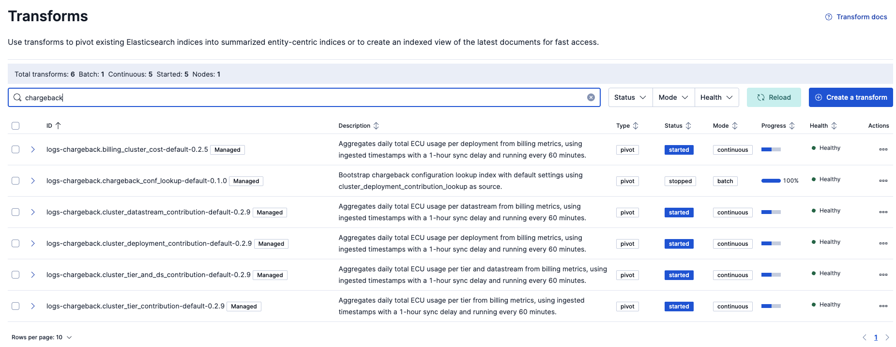
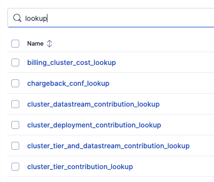
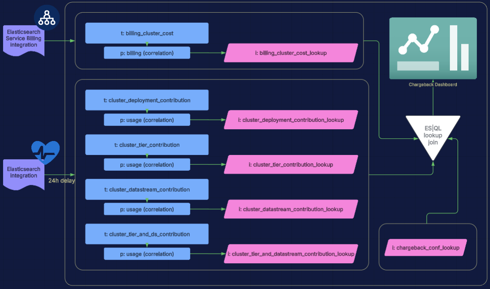
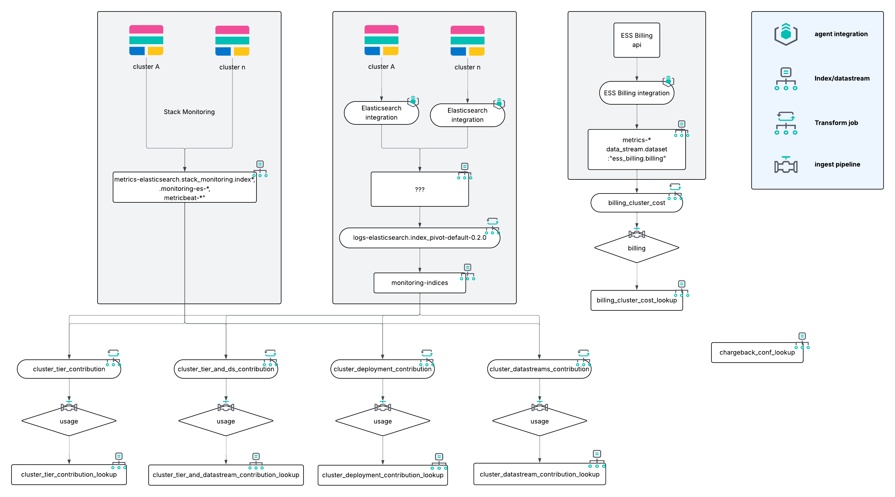
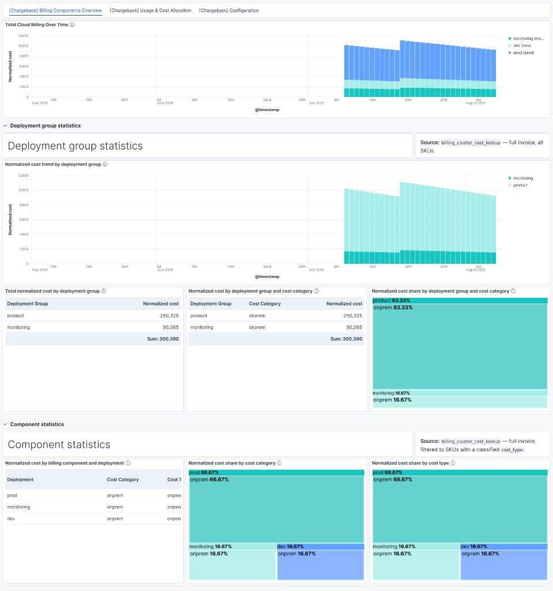
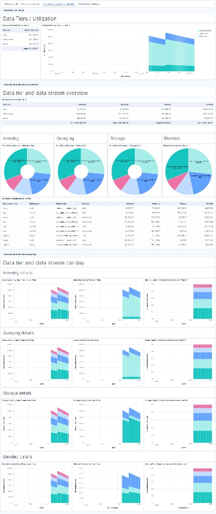
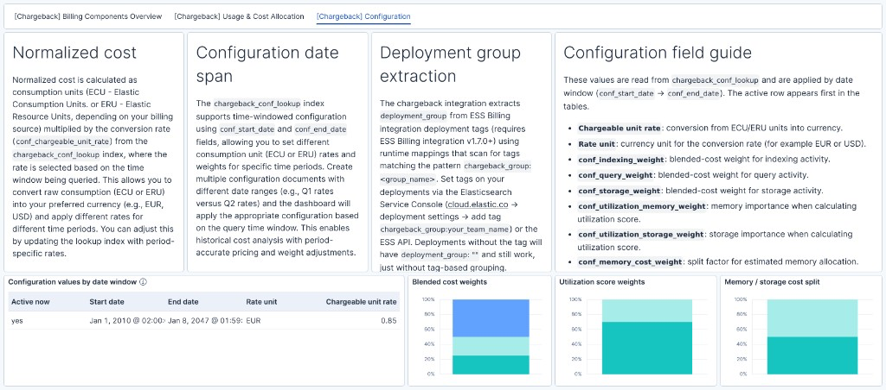

# Elasticsearch Chargeback integration

## Version

Chargeback integration: 0.4.1

## Dependencies

This process must be set up on the **Monitoring cluster**, where all monitoring data is collected.

### Requirements

To use this integration, the following prerequisites must be met:

- The monitoring cluster, where this integration is installed, must be on version 9.2.0+ due to its use of (smart) [ES|QL LOOKUP JOIN](https://www.elastic.co/docs/reference/query-languages/esql/esql-lookup-join).
- The [**Elasticsearch Service Billing**](https://www.elastic.co/docs/reference/integrations/ess_billing/) integration (v1.7.0+) must be installed and running so that at least one concrete backing index matches `metrics-ess_billing.billing-*` before Chargeback starts (the `chargeback_conf_lookup` bootstrap transform uses that pattern as its source trigger).
- The [**Elasticsearch**](https://www.elastic.co/docs/reference/integrations/elasticsearch/) integration (v1.16.0+) must be **installed and actively running** on all monitored deployments, with the following datasets enabled:
  - **Index stats** — required for tier and data stream cost allocation. The `logs-elasticsearch.index_pivot-default-{VERSION}` transform must be running to aggregate these into `monitoring-indices`.
  - **Node stats** from data nodes — required for the realized cost utilization score. Node stats are read from `metrics-elasticsearch.stack_monitoring.node_stats-*`, `.monitoring-es-*`, or `metricbeat-*` depending on your deployment type. Without node stats, utilization defaults to 100% and no discount is applied.

This integration must be installed on the **Monitoring cluster** where the above mentioned relevant usage and billing data is collected.

**Install order:** ESS Billing (or On-Premises Billing) with backing indices → Elasticsearch integration (index pivot + node stats) → Chargeback.

### Version compatibility

| Integration Version | Required Stack Version | ESS Billing Version | Notes |
|---------------------|------------------------|---------------------|-------|
| Up to 0.2.1 | 8.18.0+ | 1.4.1+ | Basic ES\|QL LOOKUP JOIN support |
| 0.2.2 - 0.2.9 | 9.2.0+ | 1.4.1+ | Requires smart lookup join (conditional joins) |
| 0.2.10 - 0.2.x | 9.2.0+ | 1.7.0+ | Requires ESS Billing 1.7.0 features |
| 0.3.0 | 9.2.0+ | 1.7.0+ | Chargeable units schema (breaking change from 0.2.x) |
| 0.3.1 - 0.3.2 | 9.2.0+ | 1.7.0+ | Field renames, deployment_tags fix, explicit lookup mappings |
| 0.4.0 | 9.2.0+ | 1.7.0+ | Realized cost model, SKU classification, three-dashboard split |
| 0.4.1 | 9.2.0+ | 1.7.0+ | `ds_type` / `ds_namespace` parse + Workload Breakdown columns; `event.ingested` on lookups |

## Setup instructions

Please see [Integration `Instructions.md`](Instructions.md) to install the integration.

## Troubleshooting

See [Instructions.md — Troubleshooting](Instructions.md#troubleshooting) and [docs/troubleshooting.md](docs/troubleshooting.md).

## Data flow

The Chargeback Module is building on two distinct data sets: 
- The output of the Elasticsearch Service Billing integration, i.e. `metrics-ess_billing.billing-default` index.
- The output of the Elasticsearch integration usage data, specifically that of the `logs-elasticsearch.index_pivot-default-{VERSION}` transform, ie. `monitoring-indices` index.

The first layer of processing that we do, is eight transforms:

**Billing transforms:**
- `billing_cluster_cost` — total chargeable units (ECU/ERU) per deployment, per SKU, per day. Includes `cost_type`, `cost_category`, and `is_allocatable` classification.
- `billing_realized_pool` — allocatable data-tier capacity pool per deployment per day (the provisioned ECU ceiling for data nodes only).
- `chargeback_conf_lookup` — configuration bootstrap (rate, weights, date windows).

**Utilization transforms:**
- `cluster_capacity_utilization` — p95 heap and disk utilization across data-role nodes per deployment per day.

**Usage transforms** (from monitoring indices):
- `cluster_deployment_contribution` — indexing, querying, and storage metrics per deployment per day.
- `cluster_tier_contribution` — same metrics split by data tier.
- `cluster_datastream_contribution` — same metrics split by data stream; usage pipeline sets `ds_type` and `ds_namespace`.
- `cluster_tier_and_ds_contribution` — same metrics split by both tier and data stream (includes `ds_type` and `ds_namespace`).

All lookup destination documents include ECS `event.ingested` (when the row was written).

All of the transforms create their own lookup index. There is also a lookup index for the configuration. Starting from version 0.2.8, all transforms are configured to auto-start upon installation. **Version 0.2.10 introduces automated creation of the `chargeback_conf_lookup` index via a bootstrap transform**, eliminating the need for manual index creation.

**Performance Note:** On clusters with months of historical monitoring data for multiple deployments, the initial transform execution may process a large volume of data. This can cause temporary performance impact during the first run. The transforms will then run incrementally on their configured schedules (15-60 minute intervals), processing only new data with minimal overhead.

To be able to take indexing, querying and storage into consideration in a weighted fashion, we use the following weights (see  [Integration `Instructions.md`](Instructions.md) on how to change these):
- indexing: 20 (only considered for the hot tier)
- querying: 20
- storage: 40

This means that storage will contribute the most to the blended cost calculation, and that indexing will only contribute to this blended cost on the hot tier. You should consider these weights, and adjust these based on your own best judgement. 

## Dashboards

The integration ships three focused dashboards with a navigation bar linking between them:

### [Chargeback] Billing Components Overview

Answers: *what did we spend and where did it go?*

- **Deployment group statistics** — total cost and trend per `chargeback_group` tag.
- **Component statistics** — cost by billing component (`cost_type`: datahot/datacontent, datawarm, datacold, transfer, snapshot, …) and FinOps category (`cost_category`), normalized to your configured currency rate.

### [Chargeback] Usage & Cost Allocation

Answers: *which data streams and tiers drive cost, and how efficiently are we using capacity?*

- **Data tiers / utilization** — provisioned capacity versus realized pool (`chargeable_pool = provisioned × util_score`), p95 heap and disk utilization.
- **Data tier and data stream overview** — top-20 data streams by indexing / query / storage cost, blended cost totals, and Workload Breakdown table columns for data stream type, namespace, data stream, and tier.
- **Data tier and data stream per day** — time-series cost breakdown (indexing, querying, storage, blended) by data stream and tier, including percentage share panels.

For shared deployments, assign each team a unique Fleet namespace so streams follow `<type>-<dataset>-<namespace>`. Chargeback parses those segments into the Workload Breakdown table. Interactive control-bar filters on `ds_*` are deferred to a later 0.5.x line.

### [Chargeback] Configuration

A standalone reference dashboard showing all active configuration values: conversion rate, date windows, blended cost weights, utilization score weights, and memory/storage cost split — each visualised as a percentage-stacked bar chart.

## Alerting Rules

Version 0.2.8 includes three pre-configured Kibana alerting rule templates to help monitor your Chargeback integration:

1. **Transform Health Monitoring** - Monitors the health status of all Chargeback transforms and alerts when issues are detected
2. **New Chargeback Group Detection** - Notifies when a new `chargeback_group` tag is added to a deployment
3. **Missing Usage Data** - Alerts when a deployment with a chargeback group assigned is not sending usage/consumption data

These alerting templates are automatically installed with the integration and can be configured through **Stack Management → Rules** in Kibana.

**Important:** For alert rules 2 and 3, ensure that the Chargeback transforms are running before setting them up. These alerting rules query the lookup indices created by the transforms (`billing_cluster_cost_lookup`, `cluster_deployment_contribution_lookup`, etc.). If the transforms are not started, the alerts will not function correctly.

## Version 0.4.1 Release Notes

### Added

- Parse `datastream` into `ds_type` / `ds_namespace` (fallback `other`) on the usage path; Usage dashboard Workload Breakdown table includes Data stream type and Namespace columns ([#23](https://github.com/elastic/elasticsearch-chargeback/issues/23)). No control-bar filters in this release.
- ECS `event.ingested` on all transform destination ingest pipelines ([#97](https://github.com/elastic/elasticsearch-chargeback/issues/97)).
- Docs: bootstrap install order ([#96](https://github.com/elastic/elasticsearch-chargeback/issues/96)); expected small deltas vs ESS Billing for incomplete UTC days ([#66](https://github.com/elastic/elasticsearch-chargeback/issues/66)).

### Changed

- Package version **0.4.1**; Kibana remains `^9.2.0`. Transform pipeline refs and `fleet_transform_version` bumped to `0.4.1`.
- Integration source: [elastic/integrations#20479](https://github.com/elastic/integrations/pull/20479).

## Version 0.4.0 Release Notes

### Added

- **Realized cost model**: two new transforms (`billing_realized_pool`, `cluster_capacity_utilization`) compute a utilization-discounted `chargeable_pool` per deployment per day. Configurable via `conf_utilization_memory_weight` (default 70), `conf_utilization_storage_weight` (default 30), and `conf_utilization_floor` (default 0.10).
- **SKU cost classification**: `cost_type`, `cost_category`, and `is_allocatable` fields stored in `billing_cluster_cost_lookup` via the billing ingest pipeline, covering all major SKU families.
- **Three focused dashboards**: `[Chargeback] Billing Components Overview`, `[Chargeback] Usage & Cost Allocation`, and `[Chargeback] Configuration` with cross-dashboard navigation bar. Replace the previous monolithic dashboard.

### Changed

- All transforms bumped to `fleet_transform_version: 0.4.0`.
- Dashboard ES|QL uses `chargeable_pool` for tier and data-stream cost allocation.

### Upgrade from 0.3.x

1. Reset and restart `billing_cluster_cost` to backfill `cost_type`/`cost_category`/`is_allocatable`.
2. Ensure `node_stats` data is flowing into `metrics-elasticsearch.stack_monitoring.node_stats-*` for utilization. Without it, utilization defaults to 100% (full provisioned cost).
3. The old `[Chargeback] Cost and Consumption breakdown` dashboard is removed. Re-import the integration to install the three replacement dashboards.

## Version 0.3.2 Release Notes

### Fixed

- **Dashboard ES|QL (#99):** Adds legacy ECU field aliases (`total_ecu`, `conf_ecu_rate`, `conf_ecu_rate_unit`) that point to chargeable-unit fields on lookup mappings so bundled dashboard `COALESCE` queries validate. See [troubleshooting](docs/troubleshooting.md) for upgrade steps (recreate + reset transforms on existing 0.3.1 lookup indices).

### Added

- Repository and integration troubleshooting guide; README support model (Field, non-GA) — [#93](https://github.com/elastic/elasticsearch-chargeback/issues/93).

### Changed

- Usage transforms source indices: `monitoring-indices*` and `*:monitoring-indices*` for custom Elasticsearch integration index-pivot destinations.

## Version 0.3.1 Release Notes

### Enhancements
- **Explicit `billing_cluster_cost_lookup` mappings removed** from `manifest.yml` (managed by transform field definitions).
- **`deployment_tags` fix:** billing_cluster_cost transform now handles `ess.billing.deployment_tags` as either a string or array.
- **Dashboard:** Added `@timestamp` exists filter for package validation.
- Bumped all transform pipeline versions to `0.3.1-billing` / `0.3.1-usage`.

## Version 0.3.0 Release Notes

### Breaking changes
- **ECU → chargeable units:** Field names have been renamed for consistency: `total_ecu` → `total_chargeable_units`, `conf_ecu_rate` → `conf_chargeable_unit_rate`, `conf_ecu_rate_unit` → `conf_chargeable_unit_rate_unit`. Dashboard ES|QL and config lookup index use the new names. Existing data in lookup indices from 0.2.x uses the old schema; see upgrade documentation for migration.

### Maintenance
- Bumped all transform pipeline versions to 0.3.0

## Version 0.2.10 Release Notes

### Bug Fixes
- **Visualization Display Issues:** Fixed visualizations not loading correctly due to integer division returning zero in ES|QL queries. All calculations now use TO_DOUBLE type conversion to prevent this issue.

### Enhancements
- **Automated Configuration Index:** The `chargeback_conf_lookup` index is now automatically created via a bootstrap transform during installation. This eliminates the need for manual index creation steps.
  - Default chargeable unit rate: 0.85 EUR
  - Default weights: indexing=20, query=20, storage=40
  - Default date range: 2010-01-01 to 2046-12-31

### Maintenance
- Bumped all transform pipeline versions to 0.3.0