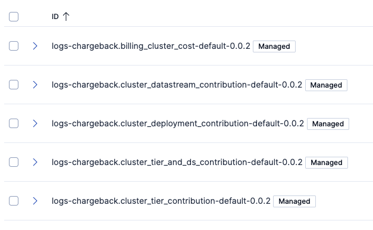

# Elasticsearch Chargeback integration

## Version

Chargeback integration: 0.2.10

## Dependencies

This process must be set up on the **Monitoring cluster**, where all monitoring data is collected.

### Requirements

To use this integration, the following prerequisites must be met:

- The monitoring cluster, where this integration is installed, must be on version 9.2.0+ due to its use of (smart) [ES|QL LOOKUP JOIN](https://www.elastic.co/docs/reference/query-languages/esql/esql-lookup-join).
- **Billing data** from one of:
  - The [**Elasticsearch Service Billing**](https://www.elastic.co/docs/reference/integrations/ess_billing/) integration (v1.7.0+) for Elastic Cloud deployments, OR
  - The [**On-Premises Billing**](../onprem/README.md) integration for self-managed deployments
- The [**Elasticsearch**](https://www.elastic.co/docs/reference/integrations/elasticsearch/) integration (v1.16.0+) must be installed, but needs not to be added to an agent. 
- The Transform named `logs-elasticsearch.index_pivot-default-{VERSION}` must be running, which is an asset of the **Elasticsearch** integration. This is the only required asset of the **Elasticsearch** integration.

This integration must be installed on the **Monitoring cluster** where the above mentioned relevant usage and billing data is collected.

### Version compatibility

| Integration Version | Required Stack Version | Billing Source | Notes |
|---------------------|------------------------|----------------|-------|
| Up to 0.2.1 | 8.18.0+ | ESS Billing 1.4.1+ | Basic ES\|QL LOOKUP JOIN support |
| 0.2.2 - 0.2.9 | 9.2.0+ | ESS Billing 1.4.1+ | Requires smart lookup join (conditional joins) |
| 0.2.10+ | 9.2.0+ | ESS Billing 1.7.0+ or On-Prem Billing 0.1.0+ | Requires ESS Billing 1.7.0 features |

## Setup instructions

Please see [Integration `Instructions.md`](Instructions.md) to install the integration.

## Data flow

The Chargeback Module is building on two distinct data sets: 
- **Billing data** from either:
  - The Elasticsearch Service Billing integration (`metrics-ess_billing.billing-default`), OR
  - The On-Premises Billing integration (`metrics-ess_billing.billing-onprem`)
- **Usage data** from the Elasticsearch integration, specifically the `logs-elasticsearch.index_pivot-default-{VERSION}` transform output (`monitoring-indices` index).

The first layer of processing that we do, is five transforms: 

- From the billing data, we get one value, namely the total ECU (cost), per deployment per day.
- From the usage data, we get values for indexing, querying and storage:
    - per deployment per day.
    - per tier per day.
    - per deployment, per datastream per day.
    - per tier, per datastream per day.

All of the transforms create their own lookup index. There is also a lookup index for the configuration. Starting from version 0.2.8, all transforms are configured to auto-start upon installation. **Version 0.2.10 introduces automated creation of the `chargeback_conf_lookup` index via a bootstrap transform**, eliminating the need for manual index creation.

**Performance Note:** On clusters with months of historical monitoring data for multiple deployments, the initial transform execution may process a large volume of data. This can cause temporary performance impact during the first run. The transforms will then run incrementally on their configured schedules (15-60 minute intervals), processing only new data with minimal overhead.

To be able to take indexing, querying and storage into consideration in a weighted fashion, we use the following weights (see  [Integration `Instructions.md`](Instructions.md) on how to change these):
- indexing: 20 (only considered for the hot tier)
- querying: 20
- storage: 40

This means that storage will contribute the most to the blended cost calculation, and that indexing will only contribute to this blended cost on the hot tier. You should consider these weights, and adjust these based on your own best judgement. 

## Dashboards

Once you have uploaded the integration, you can navigate to the `[Chargeback] Cost and Consumption breakdown` dashboard that provides the Chargeback insight into deployments, data streams and data tiers.

## Sample dashboard

## Alerting Rules

Version 0.2.8 includes three pre-configured Kibana alerting rule templates to help monitor your Chargeback integration:

1. **Transform Health Monitoring** - Monitors the health status of all Chargeback transforms and alerts when issues are detected
2. **New Chargeback Group Detection** - Notifies when a new `chargeback_group` tag is added to a deployment
3. **Missing Usage Data** - Alerts when a deployment with a chargeback group assigned is not sending usage/consumption data

These alerting templates are automatically installed with the integration and can be configured through **Stack Management → Rules** in Kibana.

**Important:** For alert rules 2 and 3, ensure that the Chargeback transforms are running before setting them up. These alerting rules query the lookup indices created by the transforms (`billing_cluster_cost_lookup`, `cluster_deployment_contribution_lookup`, etc.). If the transforms are not started, the alerts will not function correctly.

## Version 0.2.10 Release Notes

### Bug Fixes
- **Visualization Display Issues:** Fixed visualizations not loading correctly due to integer division returning zero in ES|QL queries. All calculations now use TO_DOUBLE type conversion to prevent this issue.

### Enhancements
- **Automated Configuration Index:** The `chargeback_conf_lookup` index is now automatically created via a bootstrap transform during installation. This eliminates the need for manual index creation steps.
  - Default ECU rate: 0.85 EUR
  - Default weights: indexing=20, query=20, storage=40
  - Default date range: 2010-01-01 to 2046-12-31

### Maintenance
- Bumped all transform pipeline versions to 0.2.10