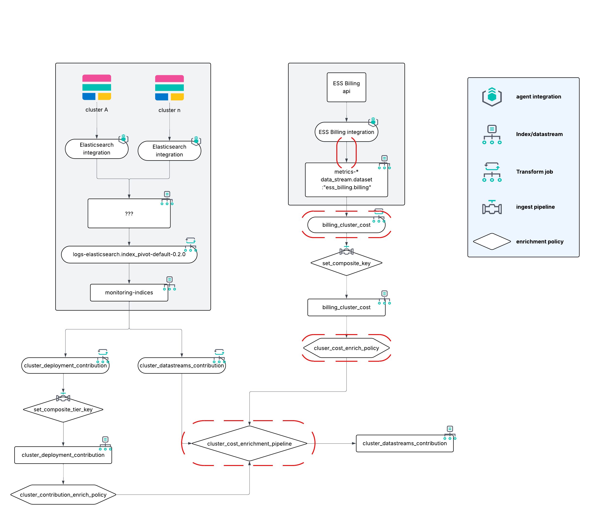

# Value upgrade
These instruction are needed if you deployed the Chargeback module previously and want to include the value insights.
This will create the insights for any data coming in post these steps.


## Modifications

There are 4 components that get modified to include the value insights.

1. The ESS Billing integration; This is the starting point of adding the insight.
2. The `billing_cluster_cost` transformation to include and calculate the value.
3. The `cluster_cost_enrichment_policy` to ensure the insights are retained.
4. The `cluster_cost_enrichment_pipeline` to use the insights and calculate the value for datastream level insights.


## 1 Billing integration
To calculate the _value_ of your ECU, you need to add a rate to the ESS billing information. This will cascade down.
Modify the `ess.billing.ecu_value` field with your value rate. E.g if 1 ECU is $2.2 worth you would modify the `0.85` to `2.2`

>These instructions assume this pipeline does not exist yet!
>Note: this custom pipeline should be generated on the environment where the ESS billing integration is running.


```json
PUT _ingest/pipeline/metrics-ess_billing.billing@custom
{
    "description": "Add the value of ECU to the billing information",
    "processors": [
        {
            "set": {
                "field": "ess.billing.ecu_value",
                "value": 0.85
            }
        },
        {
            "script": {
                "lang": "painless",
                "tag": "cost_script",
                "description": "calculates the total ECU value based on the ecu_value field and ess.billing.total_ecu",
                "source": "ctx['ess']['billing']['total_ecu_value'] = ctx['ess']['billing']['total_ecu'] * ctx['ess']['billing']['ecu_value'];",
                "ignore_failure": true
            }
        },
        {
            "script": {
                "lang": "painless",
                "tag": "cost_script",
                "description": "calculates the ECU rate value based on the ecu_value field and ess.billing.rate.value",
                "source": "ctx['ess']['billing']['rate']['ecu_value'] = ctx['ess']['billing']['rate']['value'] * ctx['ess']['billing']['ecu_value'];ctx['ess']['billing']['rate']['ecu_formatted_value'] = ctx['ess']['billing']['rate']['value'] * ctx['ess']['billing']['ecu_value'] + ' per ' + ctx['ess']['billing']['unit'];",
                "ignore_failure": true
            }
        }
    ],
    "on_failure": [
        {
            "set": {
                "field": "event.kind",
                "value": "pipeline_error"
            }
        },
        {
            "append": {
                "field": "error.message",
                "value": "{{{ _ingest.on_failure_message }}}"
            }
        }
    ]
}
```
File: [`ess_billing_custom.json`](./assets/pipelines/ess_billing_custom.json)

## 2 Modify the billing_cluster_cost Transform
The modification needed is in the `pivot` configuration. This cannot be done on an existing transform job and requires us to delete the existing one and recreate it; This includes the destination index as we modify the group_by property.

1. Stop the transform job
2. Delete the transform job and the dest index
3. Recreate the transform job
4. start the transform job

### Stop the job
```
POST _transform/billing_cluster_cost/_stop
```

### Delete the job
```
DELETE _transform/billing_cluster_cost?delete_dest_index=true
```
The `delete_dest_index=true` enables the deletion of the destination index in one go.

### Recreate the job
```json
PUT _transform/billing_cluster_cost
{
  "source": {
    "index": [
      "metrics-ess_billing.billing-default"
    ],
    "query": {
      "range": {
        "ess.billing.total_ecu": {
          "gt": 0
        }
      }
    }
  },
  "dest": {
    "index": "billing_cluster_cost",
    "pipeline": "set_composite_key"
  },
  "frequency": "60m",
  "sync": {
    "time": {
      "field": "event.ingested",
      "delay": "1h"
    }
  },
  "pivot": {
    "group_by": {
      "@timestamp": {
        "date_histogram": {
          "field": "@timestamp",
          "calendar_interval": "1d"
        }
      },
      "deployment_id": {
        "terms": {
          "field": "ess.billing.deployment_id"
        }
      },
      "deployment_name": {
        "terms": {
          "field": "ess.billing.deployment_name"
        }
      },
      "ecu_rate": {
        "terms": {
          "field": "ess.billing.ecu_value"
        }
      }
    },
    "aggregations": {
      "total_ecu": {
        "sum": {
          "field": "ess.billing.total_ecu"
        }
      },
      "total_ecu_value": {
        "sum": {
          "field": "ess.billing.total_ecu_value"
        }
      }
    }
  }
}
```
File: [`billing_cluster_cost_transform.json`](./assets/transforms/billing_cluster_cost_transform.json)

### Start the transform job
```
POST _transform/billing_cluster_cost/_start
```

## 3 Update the enrichment policy
To update an enrichment policy it cannot be in use. Hence we need to _temporary remove_ it from the pipeline.

1. remove from pipeline
2. delete enrichment policy
3. recreate enrichment policy and execute it
Re-adding it will be done in the next step (4).

### remove from pipeline
This step temporary removes the first `enrich` processor from the pipeline
```json
PUT _ingest/pipeline/cluster_cost_enrichment_pipeline
{
  "processors": [
    {
      "script": {
        "source": """
          ctx.composite_key = ctx['@timestamp'] + '_' + ctx.cluster_name;
          ctx.composite_tier_key = ctx.composite_key + "_" + ctx.tier.replace("/","_");
          ctx.deployment_id = ctx.cluster_name;
        """
      }
    },
    {
      "enrich": {
        "policy_name": "cluster_contribution_enrich_policy",
        "field": "composite_tier_key",
        "target_field": "deployment_contribution",
        "max_matches": 1
      }
    },
    {
      "script": {
      "source": """ 
        if (ctx.data_stream_cost != null && ctx.deployment_contribution != null) {

            ctx.deployment_name = ctx.data_stream_cost.deployment_name;

            if (ctx.sum_indexing_time > 0) {
                if (ctx.deployment_contribution.sum_indexing_time != null && ctx.deployment_contribution.sum_indexing_time != 0) 
                    ctx.ecu_index_contribution = Math.round((ctx.sum_indexing_time / ctx.deployment_contribution.sum_indexing_time) * ctx.data_stream_cost.total_ecu * 1000) / 1000.0;
                    ctx.ecu_value_index_contribution = Math.round((ctx.sum_indexing_time / ctx.deployment_contribution.sum_indexing_time) * ctx.data_stream_cost.total_ecu_value * 1000) / 1000.0;
            }

            if (ctx.sum_query_time > 0) {
                if (ctx.deployment_contribution.sum_query_time != null && ctx.deployment_contribution.sum_query_time != 0)
                    ctx.ecu_query_contribution = Math.round((ctx.sum_query_time / ctx.deployment_contribution.sum_query_time) * ctx.data_stream_cost.total_ecu * 1000) / 1000.0;
                    ctx.ecu_value_query_contribution = Math.round((ctx.sum_query_time / ctx.deployment_contribution.sum_query_time) * ctx.data_stream_cost.total_ecu_value * 1000) / 1000.0;
            }

            // Gets the storage contribution from the primary data set size. For searchable snapshots this is the only value available.
            if (ctx.sum_data_set_store_size > 0) {
                if (ctx.deployment_contribution.sum_data_set_store_size != null && ctx.deployment_contribution.sum_data_set_store_size != 0)
                    ctx.ecu_storage_contribution = Math.round((ctx.sum_data_set_store_size / ctx.deployment_contribution.sum_data_set_store_size) * ctx.data_stream_cost.total_ecu * 1000000) / 1000000.0;
                    ctx.ecu_value_storage_contribution = Math.round((ctx.sum_data_set_store_size / ctx.deployment_contribution.sum_data_set_store_size) * ctx.data_stream_cost.total_ecu_value * 1000000) / 1000000.0;
            }

            // Overwrites the storage contribution when we have sum_store_size availble. This will be the case for all non-searchable snapshot data streams.
            if (ctx.sum_store_size > 0) {
              if (ctx.deployment_contribution.sum_store_size != null && ctx.deployment_contribution.sum_store_size != 0)
                  ctx.ecu_storage_contribution = Math.round((ctx.sum_store_size / ctx.deployment_contribution.sum_store_size) * ctx.data_stream_cost.total_ecu * 1000000) / 1000000.0;
                  ctx.ecu_value_storage_contribution = Math.round((ctx.sum_store_size / ctx.deployment_contribution.sum_store_size) * ctx.data_stream_cost.total_ecu_value * 1000000) / 1000000.0;
            }
         }
        """
      }
    }
  ]
}
```
### delete enrichment policy
```
DELETE /_enrich/policy/cluster_cost_enrich_policy
```
### recreate enrichment policy and execute it
```json
PUT /_enrich/policy/cluster_cost_enrich_policy
{
  "match": {
    "indices": "billing_cluster_cost",
    "match_field": "composite_key",
    "enrich_fields": ["total_ecu","deployment_name","total_ecu_value", "ecu_rate"]
  }
}
```
File: [`cluster_cost_enrich_policy.json`](./assets/enrich/cluster_cost_enrich_policy.json)

```sh
POST /_enrich/policy/cluster_cost_enrich_policy/_execute
```


## 4 Calculating datastream insights
To calculate the value of what is happening on the indices/datastreams we will update the script in the `cluster_cost_enrichment_pipeline`; This will also re-add the enrichment pipeline we re-created in the previous step.

```json
PUT _ingest/pipeline/cluster_cost_enrichment_pipeline
{
  "processors": [
    {
      "script": {
        "source": """
          ctx.composite_key = ctx['@timestamp'] + '_' + ctx.cluster_name;
          ctx.composite_tier_key = ctx.composite_key + "_" + ctx.tier.replace("/","_");
          ctx.deployment_id = ctx.cluster_name;
        """
      }
    },
    {
      "enrich": {
        "policy_name": "cluster_cost_enrich_policy",
        "field": "composite_key",
        "target_field": "data_stream_cost",
        "max_matches": 1
      }
    },
    {
      "enrich": {
        "policy_name": "cluster_contribution_enrich_policy",
        "field": "composite_tier_key",
        "target_field": "deployment_contribution",
        "max_matches": 1
      }
    },
    {
      "script": {
      "source": """ 
        if (ctx.data_stream_cost != null && ctx.deployment_contribution != null) {

            ctx.deployment_name = ctx.data_stream_cost.deployment_name;

            if (ctx.sum_indexing_time > 0) {
                if (ctx.deployment_contribution.sum_indexing_time != null && ctx.deployment_contribution.sum_indexing_time != 0) 
                    ctx.ecu_index_contribution = Math.round((ctx.sum_indexing_time / ctx.deployment_contribution.sum_indexing_time) * ctx.data_stream_cost.total_ecu * 1000) / 1000.0;
                    ctx.ecu_value_index_contribution = Math.round((ctx.sum_indexing_time / ctx.deployment_contribution.sum_indexing_time) * ctx.data_stream_cost.total_ecu_value * 1000) / 1000.0;
            }

            if (ctx.sum_query_time > 0) {
                if (ctx.deployment_contribution.sum_query_time != null && ctx.deployment_contribution.sum_query_time != 0)
                    ctx.ecu_query_contribution = Math.round((ctx.sum_query_time / ctx.deployment_contribution.sum_query_time) * ctx.data_stream_cost.total_ecu * 1000) / 1000.0;
                    ctx.ecu_value_query_contribution = Math.round((ctx.sum_query_time / ctx.deployment_contribution.sum_query_time) * ctx.data_stream_cost.total_ecu_value * 1000) / 1000.0;
            }

            // Gets the storage contribution from the primary data set size. For searchable snapshots this is the only value available.
            if (ctx.sum_data_set_store_size > 0) {
                if (ctx.deployment_contribution.sum_data_set_store_size != null && ctx.deployment_contribution.sum_data_set_store_size != 0)
                    ctx.ecu_storage_contribution = Math.round((ctx.sum_data_set_store_size / ctx.deployment_contribution.sum_data_set_store_size) * ctx.data_stream_cost.total_ecu * 1000000) / 1000000.0;
                    ctx.ecu_value_storage_contribution = Math.round((ctx.sum_data_set_store_size / ctx.deployment_contribution.sum_data_set_store_size) * ctx.data_stream_cost.total_ecu_value * 1000000) / 1000000.0;
            }

            // Overwrites the storage contribution when we have sum_store_size availble. This will be the case for all non-searchable snapshot data streams.
            if (ctx.sum_store_size > 0) {
              if (ctx.deployment_contribution.sum_store_size != null && ctx.deployment_contribution.sum_store_size != 0)
                  ctx.ecu_storage_contribution = Math.round((ctx.sum_store_size / ctx.deployment_contribution.sum_store_size) * ctx.data_stream_cost.total_ecu * 1000000) / 1000000.0;
                  ctx.ecu_value_storage_contribution = Math.round((ctx.sum_store_size / ctx.deployment_contribution.sum_store_size) * ctx.data_stream_cost.total_ecu_value * 1000000) / 1000000.0;
            }
         }
        """
      }
    }
  ]
}
```
File: [`cluster_cost_enrichment_pipeline.json`](./assets/pipelines/cluster_cost_enrichment_pipeline.json)